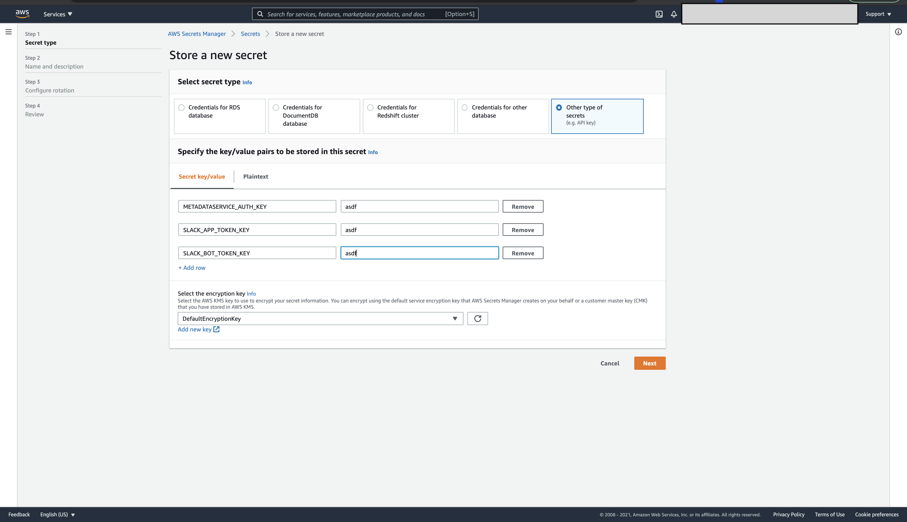
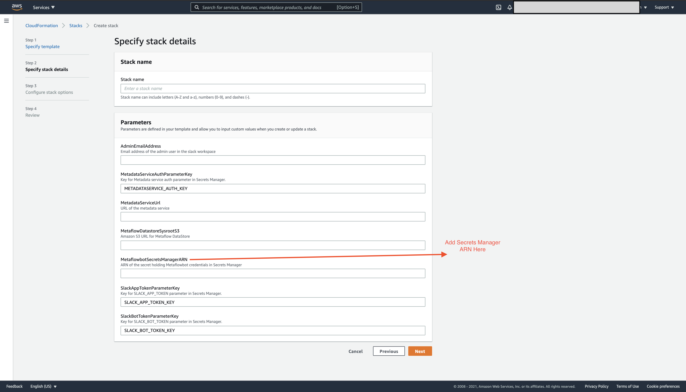

# Deploying on AWS with CloudFormation

Metaflow bot ships with an [AWS CloudFormation template](../deployment/mfbot-cfn-template.yml) that automates the deployment of all the necessary AWS resources. The template is provided in the [deployment](../deployment) folder.

Deploying the template requires Slack related authentication tokens and metadata service related authentication; These need to be created on [SecretsManager](https://console.aws.amazon.com/secretsmanager). The reference to those secrets will be used in the CloudFormation template deployment. 

The major components of the template are:

1. AWS Identity and Access Management - Set policies for Accessing S3 buckets and secrets needed for deployment. 
2. AWS VPC Networking - A VPC with public subnet and internet gateway to deploy the bot. 
3. AWS VPC Security Groups - Outbound traffic access for the bot's container. 
4. AWS ECS - Deploying the bot's container as a [Fargate](https://aws.amazon.com/fargate/) task.
5. AWS SecretsManager - Access to secret holding authentication information about Slack and Metadata service. 

## Deployment Steps

1. [Configure the bot on the slack workspace and retrieve the SLACK_BOT_TOKEN and SLACK_APP_TOKEN](./Setup.md#slack-setup)

2. Create a secret on SecretsManager with the keys relating to Metadata service authentication token and Slack bot related tokens. Copy the ARN of the secret
    

3. Paste the ARN of the secret along with other metadata + s3 related deployment details. 
    

3. Once the CloudFormation stack deployment is complete, instant message the `@flowey` bot : `version` or invite it to a channel and start messaging it.

