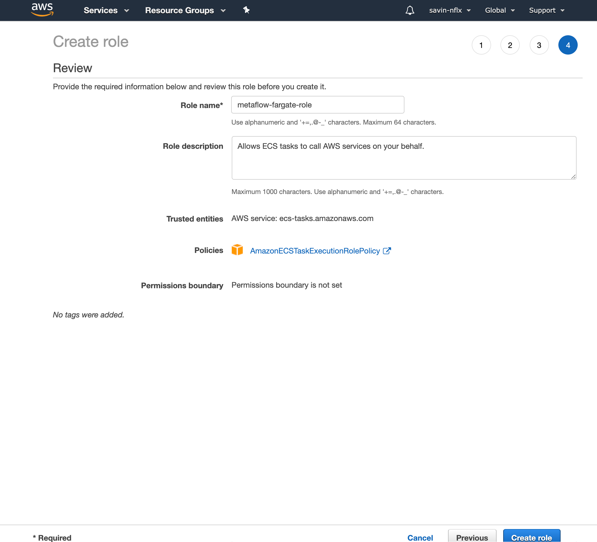

# Deploying the bot on AWS

There are many ways (automated and manual) to deploy, configure, and manage AWS resources depending on your security posture and familiarity with the AWS eco-system. If you cannot use our [AWS CloudFormation template](../deployment/mfbot-cfn-template.yml), this article lists the steps for a rather straightforward deployment of AWS resources for use by Metaflow bot.

Please note that Metaflow bot can re-use existing AWS resources - for example, your existing ECS cluster for container deployment. The instructions listed here will create these resources from scratch. If you have a strong background in administering AWS resources, you will notice that many of the security policies are fairly permissive and are intended to serve as a starting point for more complex deployments. Please reach out to us if you would like to discuss more involved deployments.

## Manually configuring bot

### Slack Access Tokens
TODO

### VPC 

1. Run the VPC Wizard
    1. Open the [Amazon VPC console](https://console.aws.amazon.com/vpc/) and in the left navigation pane, choose VPC Dashboard.
    2. Choose Launch VPC Wizard, VPC with a Single Public Subnet, Select.
    3. For VPC name, give your VPC a unique name.
    5. Choose Create VPC.
    6. When the wizard is finished, choose OK.

### IAM Role 

1. Create an IAM role for ECS Fargate Service
    1. Open the IAM console and in the navigation pane, choose Roles, Create role.
    2. For Select type of trusted entity section, choose AWS service.
    3. For Choose the service that will use this role, choose Elastic Container Service.
    4. For Select your use case, choose Elastic Container Service Task and choose Next: Permissions.
    5. Choose AmazonECSTaskExecutionRolePolicy.
    5. Choose Next:tags.
    6. For Add tags (optional), enter any metadata tags you want to associate with the IAM role, and  then choose Next: Review.
    6. For Role name, enter a name for your role and then choose Create role to finish. Note the ARN of the IAM role you just created.
    

### ECS Cluster + Fargate Task

TODO