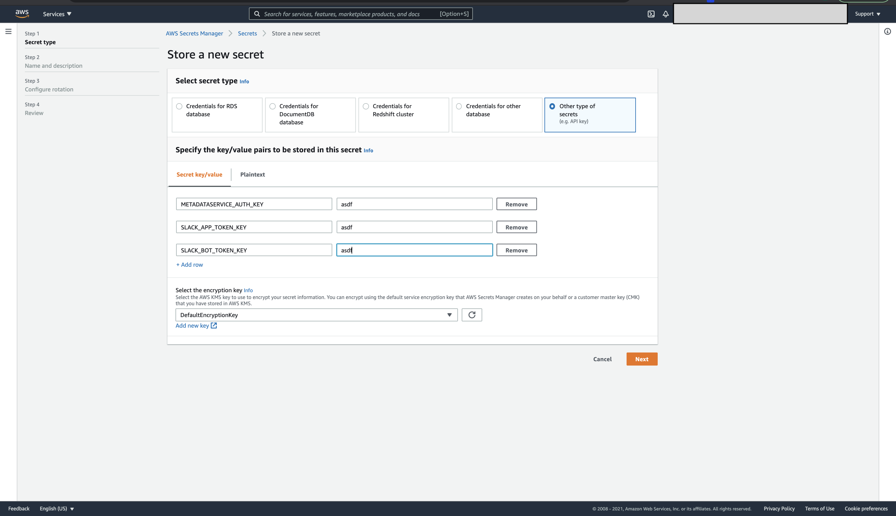

# Deploying the Bot on AWS

There are two ways to deploy the metaflowbot on AWS:

1. Via CloudFormation template 
2. Manually configuring the bot

## Deploying Via CloudFormation

The [CloudFormation template](../deployment/mfbot-cf-template.yml) provided in the [deployment](../deployment) folder requires Slack related authentication tokens and Metadata service related authentication; These need to be created on secretsmanager. The reference to those secrets will be used in the CloudFormation template deployment. 

Retrieval of slack related tokens is provided [here](./Setup.md). 

### Deployment Steps

1. Create a secret on SecretsManager with the keys relating to Metadata service authentication token and Slack bot related tokens. Copy the ARN of the secret
    

2. Paste the ARN of the secret along with other metadata + s3 related deployment details. 
    

3. Go Ahead and start talking to the bot :) 